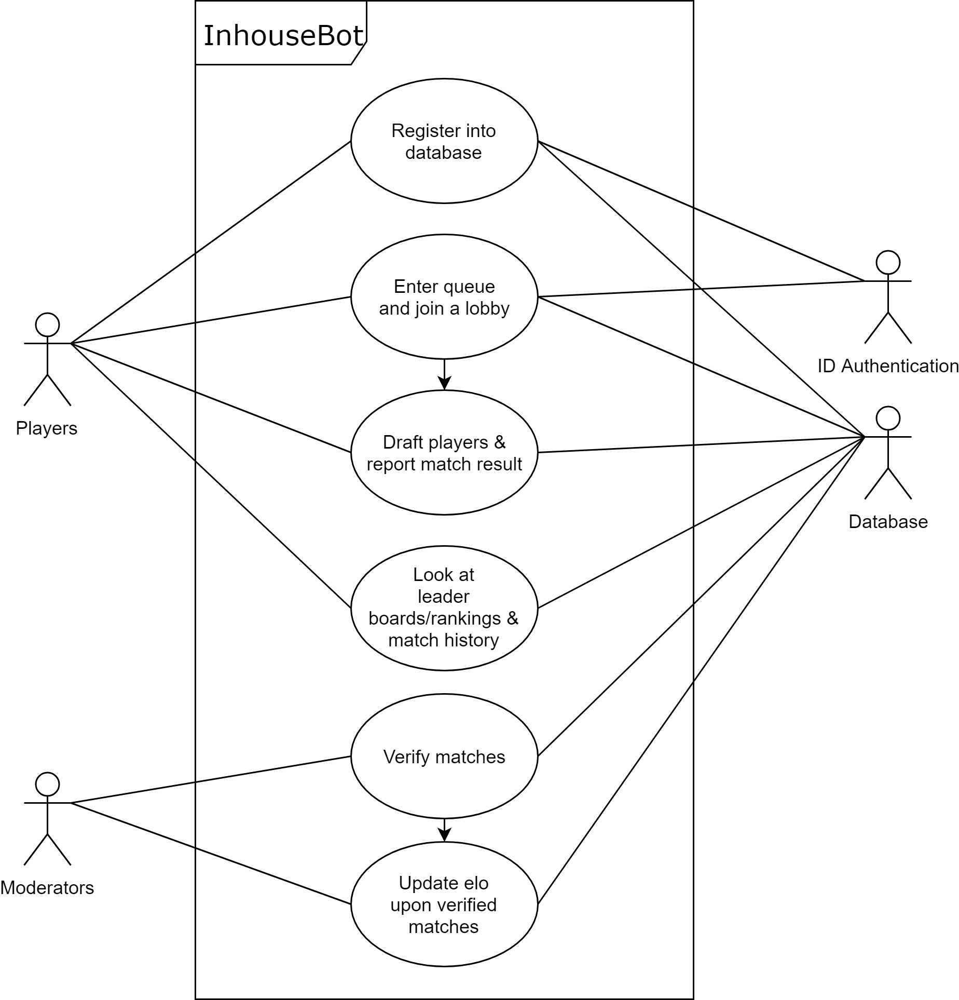

# **Inhouse Bot**

## Project Abstract

Inhouse Bot is a discord bot. It's primary function is to be an inhouse ranking system intended for League of Legends (can be easily altered for other games). The bot will support various commands asynchronously with multiple users at once. It will track and maintain the progress of each lobby and will report the winners and losers upon match completion. The system will use an elo rating system. It will also include a verification system to ensure all registered players have a legitimate account from League of Legends. Having this inhouse bot will enable Discord community servers to track and reward their most active members.

## Project Relevance

The proposal is linked to the educational goals of this class because it provides practical experience with several fields of software development. This project will utilize Git/Github, version control, testing, parallel computing or asynchronous programming, debugging, access to databases and object oriented design. These goals are all important as they help build and introduce, if not yet known, the programmers to those fields and develop them further. This will as well involve learning new APIs such as from Discord and Riot Games similar to how in the industry engineers have to learn new technologies all the time. A majority of the team members are already knowledgeable in Python, Git/Github, testing, debugging, object oriented design and asynchronous programming. What is new for most of the team members are learning new APIs and how to create and manipulate databases. 

## Conceptual Design

The project is a stand-alone project. I plan on creating the bot from the ground up. I will implement the database to store player information, the commands to invoke the bot in discord, the asynchronous nature of the bot, matchmaking system, draft captain system, leaderboards/ranking, match history and the elo rating system. The code will be based on asynchronous programming and object oriented programming. It will be coded in python.

## Goals and Milestones

The software development process will be similar to the agile development process. Our plan will reflect this as we will iteratively develop and test the code for each goal/milestone as a cohesive team.
Here are the goals and milestones listed:
- Logging System
- Local database (txt file)
- Online database
- Registration
- Leaderboards/Ranking
- Match History
- Matchmaking
- Lobby system
- Report matches

## Background

https://github.com/BasilPanda/inhousebot.py

## Required Resources

- Group members
- Hardware and software resource required

## Feedback, Expectations and Competencies & Work Plan

### Ewing

I expect to fully finish project functionality, all bot interactions and matchmaking, by the end of Spring Semester. I have previous experience with Python. learning new APIs, asynchronous programming, Git/Github, testing, debugging  and object oriented design of which are all related to the project. What I would like to do in the coming weeks, but not in immediate consideration, is make an online database for the bot to connect to and display Leaderboards of the ranking system in a clean UI.

### Devang

Ensure that the backend of the program is fully set-up and functioning regarding storing data of users, match history, ranking, etc amd allow users to interact with database through commands utilizing the Discord API. I am familiar with using Python though I haven't done much database/asynchronous programming using the language so adapting my prior knowledge to Python by researching libraries/tools will be a focus. As a end goal, being able to generalize the application to setup any sort of PvP match regardless of genre would ideal and make the program more accessible to a larger audience. 

### Nasir

I will work directly with the league of legends api and creating a matchmaking algorithm. I have background experience with the game league of legends and their ranking system so I will be using the api key to get information about certain users statistics, matchmaking history, most played characters etc. I will be using those data points to create a suggestion system for different potential team setups for inhouse games and possibly predictive analytics in the future.

### Nico

I will be researching the Discord API to figure out how to most efficiently hook our bot into the server.  I'd like to read into the full documentation to see what can be reasonably achieved with our project.  This is my main task at hand as I'd like to build upon the foundational knowledge of how to both use and manipulate the Discord API before progressing onto other, more involved tasks.  I have some background experience with Python but not nearly as much as I'd like and I think this program will help to hone in on the intricacies of the language.  My goal is to make the bot as functional as possible, utilizing the resources it has at its disposal such as the user database and LoL statistics, perhaps even a website frontend to display the user database and stats.

## Required Dependencies

python -m pip install -r requirements.txt

## Other Information

Most of the work done on this project was done in a private repo with two other members as a final project.

<<<<<<< HEAD
## How to use

Get a key from Riot's Developer Portal for bot @ https://developer.riotgames.com/ 
Put key in a config.py file named
=======
>>>>>>> origin/ee5
